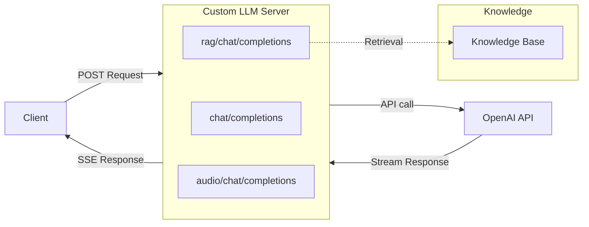
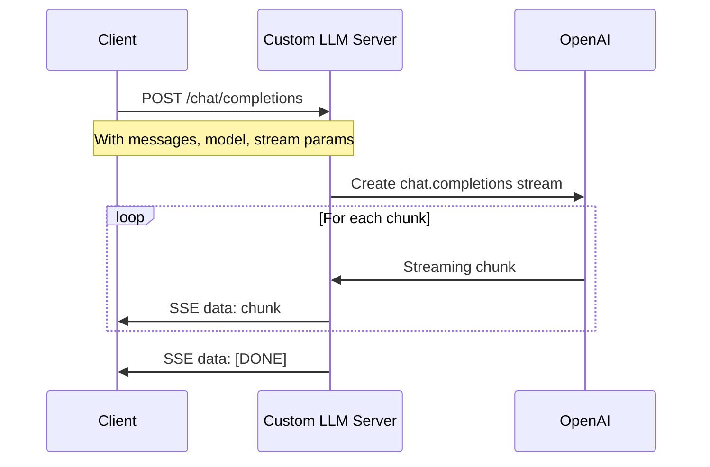
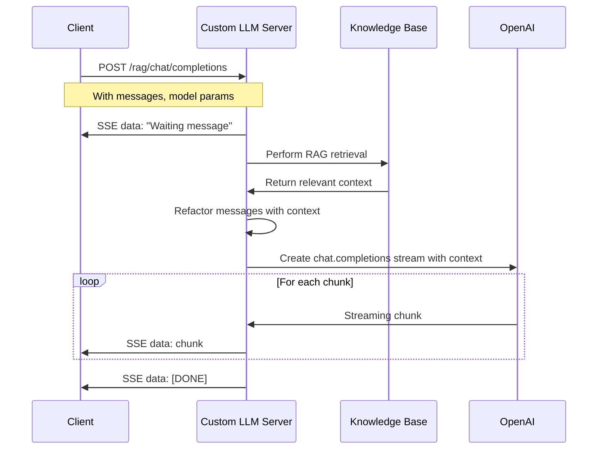
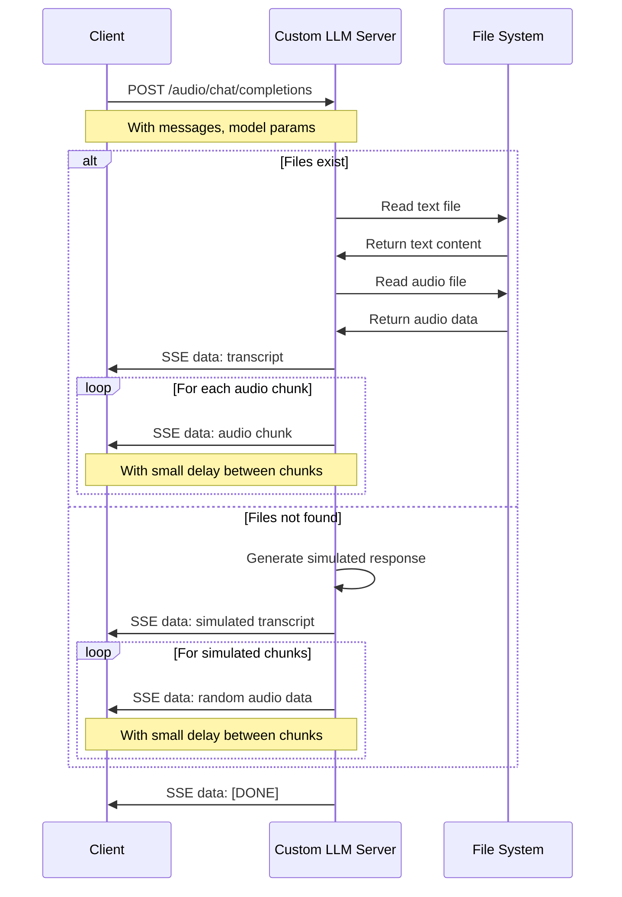

# 🌟 Custom LLM Sample Code for Python

> The Agora Conversational AI Engine supports custom large language model (LLM) functionality. You can refer to this project code to implement custom large language model functionality.

This document provides Python sample code for implementing custom large language model functionality.

## 🚀 Quick Start

### Environment Preparation

- Python 3.10+

Python virtual environment:

```bash
python3 -m venv venv
source venv/bin/activate
```

### Install Dependencies

```bash
pip install -r requirements.txt
```

### Run Sample Code

```bash
python3 custom_llm.py
```

When the server is running, you will see the following output:

```bash
INFO:     Uvicorn running on http://0.0.0.0:8000 (Press CTRL+C to quit)
```

Use the following command to test the server:

```bash
curl -X POST http://localhost:8000/chat/completions \
  -H "Content-Type: application/json" \
  -H "Authorization: Bearer YOUR_LLM_API_KEY" \
  -d '{"messages": [{"role": "user", "content": "Hello, how are you?"}], "stream": true, "model": "gpt-4o-mini"}'
```

## 🔄 Architecture and Flow Diagrams

### System Architecture



For more details about the three endpoints and their request flows, see the [Request Flow Diagrams](#📝-request-flow-diagrams) section.

## 📖 Function Description

### Basic Custom Large Language Model

> To successfully integrate with the Agora Conversational AI Engine, your custom large model service must provide an interface compatible with the OpenAI Chat Completions API.

The `/chat/completions` endpoint implements the basic chat completions functionality.

### Implementing Retrieval-Augmented Custom Large Language Model

> If you want to improve the accuracy and relevance of the agent's responses, you can use the Retrieval-Augmented Generation (RAG) feature. This allows your custom large model to retrieve information from a specific knowledge base and provide the retrieval results as context for the large model to generate answers.

The `/rag/chat/completions` endpoint demonstrates a simple implementation of RAG using a memory-based knowledge store.

### Implementing Multimodal Custom Large Language Model

> Multimodal LLMs can process and generate text, images, and audio content.

The `/audio/chat/completions` endpoint simulates an audio response with a transcript and audio data chunks.

## 📝 Request Flow Diagrams

### Basic LLM Request Flow



### RAG-enhanced LLM Request Flow



### Multimodal Audio LLM Request Flow



## 📚 Resources

- 📖 Check out our [Conversational AI Engine Documentation](https://doc.agora.io/doc/convoai/restful/landing-page) for more details
- 🧩 Visit [Agora SDK Examples](https://github.com/AgoraIO) for more tutorials and example code
- 👥 Explore high-quality repositories managed by the developer community in the [Agora Developer Community](https://github.com/AgoraIO-Community)
- 💬 If you have any questions, feel free to ask on [Stack Overflow](https://stackoverflow.com/questions/tagged/agora.io)

## 💡 Feedback

- 🤖 If you have any problems or suggestions regarding the sample projects, we welcome you to file an issue.

## 📜 License

This project is licensed under the MIT License.
